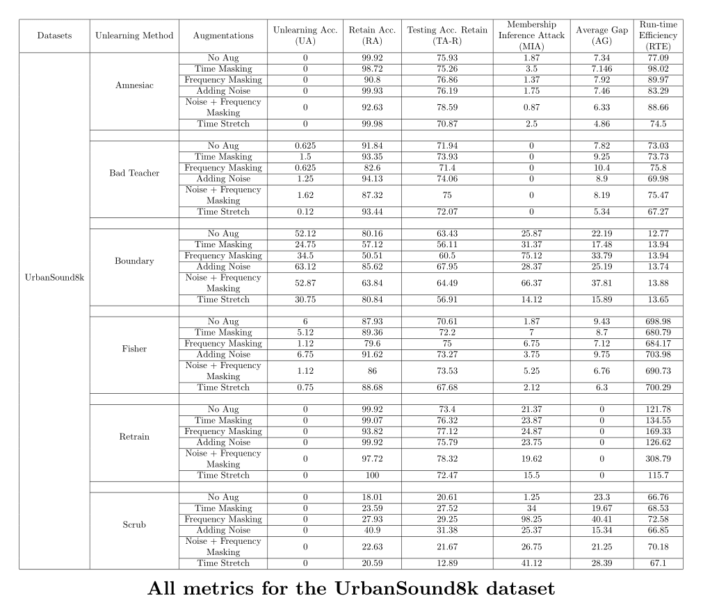

# Machine Unlearning with Data Augmentation

This repository contains **extended results tables** from the paper:  
**_Audio Augmentation Meets Audio Unlearning: Help or Hinder?_**

Due to ICASSP page constraints, the full experimental results (large tables with detailed metrics) could not be included in the main paper. This repo serves as a companion resource where the complete tables are made available in a clean, citable format.

---

## 📊 Tables

Each table reports detailed evaluation metrics for machine unlearning experiments across different **audio classification datasets**.  
The metrics include average accuracy, forgetting gap, membership inference attack (MIA) resistance, and more.

---

### 🎵 Table 1: ESC-10

Results on the **ESC-10 dataset** (environmental sound classification).  
Click to view the full PDF with all metrics.

---

### 🗣️ Table 2: SpeechCommands

Results on the **Google SpeechCommands dataset** (keyword spotting).  
Click to view the full PDF with all metrics.

---

### 🌆 Table 3: UrbanSound8K

Results on the **UrbanSound8K dataset** (urban audio classification).  
Click to view the full PDF with all metrics.

---
